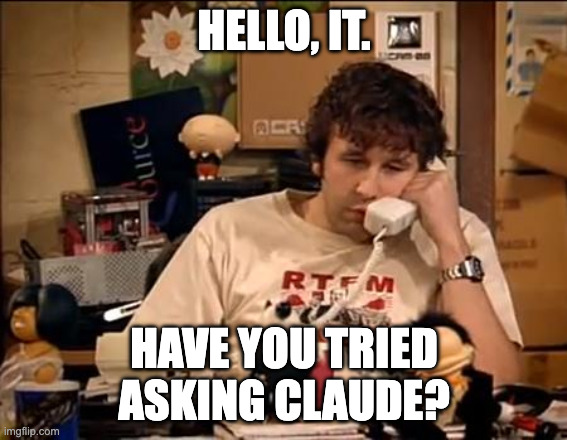

前两天我在朋友圈里冲梁圣、罗圣喊话：你们倒是发发力啊，我是真不想再给 A畜送钱了。

起因是账号。九月中下旬我的 Claude Code 号又被封了一次。为了让它多活两天，能做的我基本都做了：系统时区改成美西，系统语言换成英文，走自建的 VPN，连手机验证和 KYC 都是托人脉搞定的。之前也封过几回，这次是真的够了，不想再折腾了，所以我下定决心换到国产模型上去。

但换过去之后，用量又成了新的问题。九月中下旬那段时间我本来就用得多，9 月 20 号到月底基本天天在跑。我对模型的推理能力要求真不高，我习惯自己做逻辑设计和拆分，交给 AI 干的，基本上都是苦力活——写点 CRUD 而已，你只要量给够我就能用。可 GLM 的 token plan（1078）和火山引擎的 agent plan（1500）买回来，我基本三天就把一周的量蹬完了，而且还是在挑便宜的 flash 模型用的情况下。反过来看 Claude Code 的 20X，我到现在只有一次触到 5 日的上限。你可以嫌它麻烦、嫌 A畜不做人，但它给得是真多，规则也写在明面上。国产这几个给我的感觉是单价看着便宜，量一乘上去就反超了，那句"又菜又贵"，我实在没法不想到。当然这只是账面上的感觉，我甚至怀疑过，Claude Code 这套壳去接三方模型的时候，是不是在中间掺了屎、把用量给灌虚了，不过这个纯属瞎猜，没实锤，先记在这。

当然，换过去也没那么容易。我从今年年初开始基本就是 Claude Code 的重度用户，工作流全建在上面，换一家等于所有东西推倒重来。

国庆我基本在休息，真正把开源 harness 折腾起来是假期后半段的事：opencode、pi、dsh，顺手把几家的国产模型也接了进去。磨合到现在算是能干活了，先用 opencode 顶着——它该有的都有，侧边栏顺眼，插件和权限那套结构我也挺喜欢，等我再熟练一点，可能会去折腾 dsh，它在自定义上更放得开。跟 Claude Code 比肯定还有差距，但差的那些现在基本是我能忍的程度，而不是不能用的程度。

比较头疼的是 Claude in Chrome。浏览器自动化这块我日常依赖挺重，它又偏偏是整套里最难搬的一环，我翻了一圈没找到能直接替代的方案，最后自己动手拼了个 Chrome in harness，勉强算个部分替代。能用，但肯定不如原版顺手。既然写都写了，就顺手开源了，[项目地址在这里](https://github.com/hcfw007/chrome-in-harness)。你要是也正好卡在这一块，可以拿去试试，能省点事的话给个 star 就行，有想法也欢迎提 issue。

说实话，这一整套我一开始是被逼的。A畜那边不留我，国产模型又还没卷到能让我闭眼搬过去的程度，我卡在中间，只能自己动手把缝补上。不过补着补着也有点收获：开源生态这两年长得是真快，harness 以前是各家锁各家的，现在至少有的选，接几家国产模型进去也没想象中难。

就这样吧，先用着，能省一点是一点。尽管是被迫的，也算积极拥抱开源生态、顺带支持国模了。

永别了，A畜。

<small>图源：imgflip.com</small>
