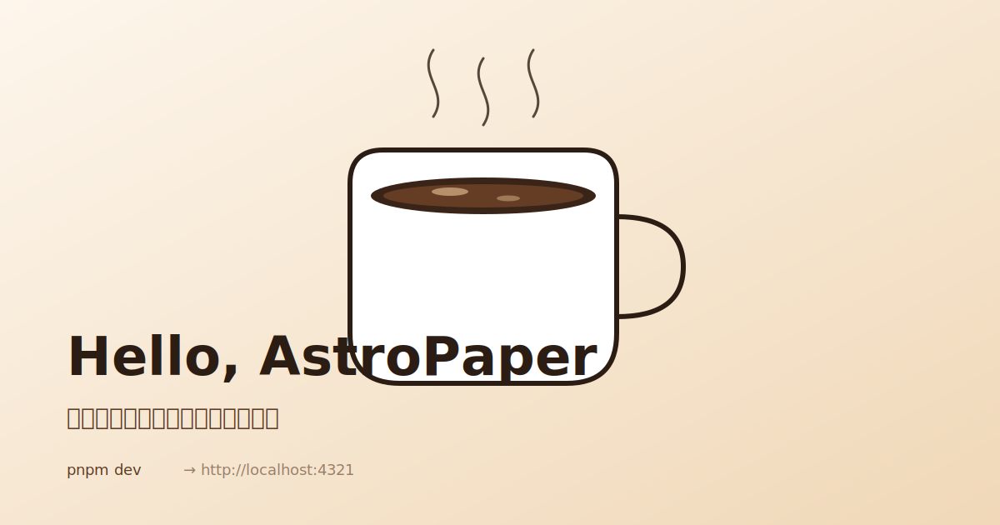

我已经数不清这是第几次重建博客了。
最早尝试在知乎写点文章，但后来知乎的氛围我不太喜欢，而且本质上我写博客的目的也不是为了分享，让其他人评论反而让我不是很舒适。
后来在aws搞了服务器和域名做自建，一方面随便记录一点东西，一方面做点技术上的练习。但一方面，aws太贵了，另一方面我也不很像再造一个博客轮子了，没啥锻炼的价值，而且后来域名没续费之后很快就被擦边网站抢注了。。。
再后来就来到了这里，cloudflare。也没啥特别的原因，现在有了 AI 编程，简单又高效，还免费。旧的数据不是 md 格式的，有价值的会搬运过来吧。

## AstroPaper

- **静态输出**：构建产物是纯 HTML/CSS，扔到 Cloudflare Pages 就完事，没有运行时。
- **类型安全的 Markdown**：`src/content.config.ts` 用 zod 定义了 frontmatter schema，写错字段构建时就报错，不用等到上线才发现 `pubDatetime` 拼成了 `pubDateTime`。
- **离线搜索**：用 [Pagefind](https://pagefind.app/) 在 `pnpm build` 之后生成静态索引，搜索不依赖任何后端服务。
- **够丑**：默认主题朴素到不会让我有"再调调字号"的冲动。

## 三条命令

理论上不需要文档：

```bash
pnpm install
pnpm dev          # http://localhost:4321
pnpm build        # astro check + 构建 + Pagefind 索引
```

`pnpm build` 是真正的"全量验证"——它先跑 `astro check` 做类型 + 内容 schema 检查，再 bundle，再用 Pagefind 给搜索建索引。如果某篇文章 frontmatter 写错了，会在这一步直接挂掉，不会让坏内容流到生产。

> 提示：`pnpm preview` 不会重新跑构建，所以你改完文章如果发现搜索结果没更新，是因为还没重建 Pagefind 索引——这是 feature 不是 bug。

## 一篇文章的结构

一篇文章就是 `src/content/posts/` 下的一个 Markdown(或 MDX)文件，最小骨架长这样：

```md
---
title: 标题
description: 摘要
pubDatetime: 2026-05-25T09:30:00+08:00
tags:
  - meta
---

正文从这里开始。
```

如果文章带配图，我喜欢给文章一个独立目录，正文叫 `index.md`，资源就近放：

```text
src/content/posts/
└── hello-astro-paper/
    ├── index.md
    └── cover.svg
```

这样一篇文章和它的所有资源是同一个迁移单位——搬家、重命名、删除都是一个目录的事。`src/utils/getPostPaths.ts` 已经针对 `<dir>/index.md` 做了 slug 折叠，所以 URL 就是干净的 `/posts/hello-astro-paper/`，不会出现父目录和文件名重复的情况。

`ogImage` 用相对当前 markdown 的路径(`./cover.svg`)，正文里也用同样的相对路径引用图片：



## 我学到的几件小事

1. **`public/` 不是图片仓库**。`public/` 只放真正不参与构建处理的东西——favicon、`robots.txt`、fallback 图。文章插图就放在文章自己的目录里，享受 Astro 的图像优化管线。
2. **子目录有两种用法**。一种是把单篇文章塞进自己的同名目录(用 `index.md`)——co-location；另一种是把多篇相关文章放进一个共享目录(参考 `2026/` 或 `notes/`)——这会给 URL 加前缀。两种都行，混用也没问题。
3. **`_` 开头的目录是隐身的**。`src/content.config.ts` 里的 glob 模式是 `**/[^_]*.{md,mdx}`，所以 `_drafts/` 这种目录天然不会被收录，用来放半成品很合适。
4. **`draft: true` 在 dev 和 prod 都会消失**。`src/utils/postFilter.ts` 里 `!data.draft` 是无条件过滤的——别指望 dev 能预览草稿，要看就把它改成 `false` 或挪到 `_drafts/`。
5. **未来时间的文章会被自动跳过**。`src/utils/postFilter.ts` 里有一个 `scheduledPostMargin`(默认 15 分钟)，pubDatetime 超过当前时间这么久的文章在生产构建里会被过滤掉，等到时间到了再发也来得及。

写到这里咖啡刚好喝完。**这次我希望博客活得比上一杯咖啡久一点。**
