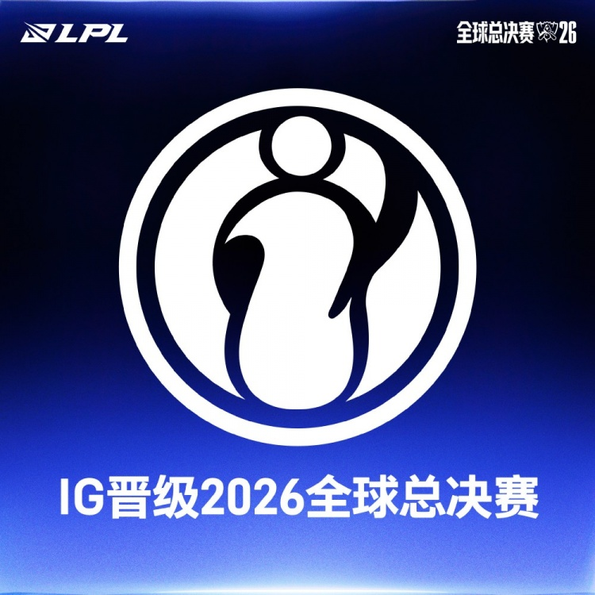

昨晚 iG 3:1 干掉了 JDG，拿到了 LPL 最后一张去 S16 的门票。赛后的文案写得挺好的："翻过最后一重山，身后是来路，眼前是世界。"

iG 今年是怎么个事呢。LPL 第三赛段按第二赛段的成绩分组，前八进登峰组，剩下的四支队伍进涅槃组，iG 就在涅槃组里。这个组名字起得很戏剧，伴随着 LPL 部分粉丝的圣经念诵，现在在网络上已经成为一个负面含义很重的词了。虽然没明着说，但本质上就是觉得你水平太菜，跟强队打没啥意义也没观赏性，自己内部自娱自乐一下得了，不要影响强队备战世界赛。涅槃组的前二也得再打一轮 BO5 的"骑士之路"，赢了才够得着季后赛的边。

这一赛段的赛制对涅槃也很不友好，以前的涅槃组打赢骑士之路之后，和前面的队伍是平等的从零开始双败，但这次骑士之路进去的队伍就直接进了败者组，直接少了一条命，每一场，其实都是生死局。8 月 28 号 iG 3-0 横扫 TT，第三局 20 分钟不到就结束了，下路把对面 AD 打得 16 分钟 80 刀，这才挤上了季后赛的末班车。

结果季后赛他们还真一路打穿了：3-2 TES，3-1 WE，3-0 LGD，然后在败者组决赛 2:3 惜败 AL，没能走到底。到了冒泡赛，先 1:3 输给 TES，三号种子没了，那晚"Theshy力竭"上了热搜。隔两天打 JDG，输不起了，再输就回家——结果 3:1。第四局 Wei 的蔚抢下大龙锁死 Gala 那一下，基本就终结了全部悬念。就这样，iG 成了 LPL 历史上第一支从涅槃组打进世界赛的队伍。算下来，从骑士之路到冒泡赛，他们这个赛段一共打了 7 个 BO5，是全球所有赛段里打得最多的——别人打完休赛准备世界赛，他们一直在打生死局。

很有意思的地方是，自从开始打 BO5 之后，他们从 Win or go home 的生死局开始，慢慢的给自己打出了一定的容错。赢了 LGD 之后锁定了冒泡赛高位，接下来就可以输两场了 —— 如果赢了 AL 输给 BLG，那也是冒泡赛高位，冒泡赛第一场输了还有最后一个名额可以争。总体看来，所有生死局他们都赢了，所有有容错的局他们都输了。建议改名呼吸队，只赢解散局。

有趣的是这套阵容的成分。TheShy 和 Rookie 是 2018 年那支冠军 iG 的核心，Meiko 是 2021 年 EDG 的冠军辅助。2018 年 iG 3-0 干掉 Fnatic 拿下 LPL 第一个世界赛冠军的时候，Rookie 还是个二十出头的少年中单；八年之后，他和 TheShy 又在同一支队伍里翻山了。Rookie 上一次站在世界赛主舞台上，还是 2019 年的半决赛，中间隔了整整七年。

而且这次带他们爬出来的不全是老将。AD 位上的 JiaQi 并非稳主力，我不确定他是从 TES 租借来的还是买来的，但第三赛段出他还要和 Assum 竞争上岗，结果打成了整条晋级路上最亮的那个人：打 TES 那轮就压过了全场，对 JDG 第二局一手伊泽瑞尔四杀直接拿赛点。老将守住了下限，年轻人抬走了上限，这种剧本谁不爱看。

我看 LPL 没有什么主队，但看完这条路还是很难不动容。从涅槃组起步，意味着你进入世界赛只有理论可能；一路赢上去，中间还要挨两次当头一棒——输给 AL、输给 TES。职业赛场大部分故事都是高开低走，起点高的队伍掉下来一点就有人喊失望，起点低的队伍往上爬一格就是奇迹。iG 把这条最难走的路走通了，无论世界赛成绩如何，这都已经足够让他们他挺起胸膛。

去年他们时隔六年重返世界赛，还是从入围赛一路打起的。这次因为规则改了，直接进瑞士轮。LPL 这次的四支队伍是 AL、BLG、TES 和 iG，要说纸面实力 iG 大概率是最末位的那支，但看完这个夏天，谁还敢小看一支翻山越岭爬上来的队伍呢。

涅槃意重生，非败者的象征。

