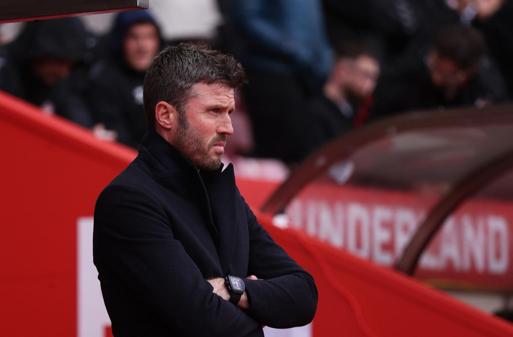

九月还没过完，但曼联这个月的比赛已经踢完了，接下来是国际比赛日。五场比赛一胜两平两负，唯一赢下来的还是欧冠对阿塞拜疆的萨巴。

9月10号，曼联时隔两年回到欧冠，主场4-0萨巴。库尼亚、B费、塞斯科上半场就进了三个，下半场利马又补了一个。对手确实弱，这场也说明不了什么，但欧冠音乐在老特拉福德响起来的时候，我还是挺感动的。可惜剩下四场就不太好看了。

先是客场2-2埃弗顿。姆伯莫和塞斯科两次帮曼联领先，两次都被世界波扳平：83分钟泰里克·乔治从一个很刁钻的角度一脚轰进死角，这还是他在埃弗顿的第一个进球；补时第6分钟，梅特兰-奈尔斯在埃弗顿的首秀里又是一脚25码挂死角。一场比赛让对手连开两个大保底，这场平局多少有点倒霉。

回到主场打曼城就是纯难受了。福登第23分钟踢B费吃了红牌，曼联11打10打了将近70分钟，一个球没进，最后还0-1输了，进球的是哈兰德。VAR还看了半天恩佐有没有越位干扰，不过判罚我倒没那么在意，最难受的还是多一个人也拿对面一点办法都没有。

联赛杯主场对布莱顿，10分钟就2-0了，上半场补时丢一个，下半场四分钟里又丢两个，2-3被翻盘，英超时代曼联还是第一次在主场两球领先输球。客场打富勒姆，上半场两队加起来26脚射门，愣是一个球都没有，下半场利马打进一个很滑稽的乌龙，89分钟库尼亚一脚折射才扳成1-1。

联赛三轮不胜，联赛杯一轮游，就这么进了国际比赛日。网上果然又开始有人喊卡里克下课了。我个人是不支持换帅的。

卡里克是今年1月阿莫林下课之后接的队，临时执教16场赢了11场，赢过曼城、阿森纳和利物浦，把球队带回了欧冠，5月才转正签了两年。现在成绩确实难看，但五场比赛能说明的东西很有限。

他接手之后把阿莫林的3-4-2-1改回了4-2-3-1，春天那波赢强队，靠的基本是防守反击。客场3-2阿森纳那场，曼联控球只有41%，xG也比对面低，但3脚射正进了3个；首秀2-0曼城，姆伯莫踢伪9号，专门往曼城高位防线身后跑。那时候曼联是弱势方，对手敢压上来，身后全是空间，前场几个人中路一两脚配合就打穿了。

但现在曼联是欧冠球队了，对手不会再压上来跟你对攻。打10个人的曼城就很典型：曼城退成一个很紧凑的低位，把中路挤死。B费、库尼亚、姆伯莫都喜欢往中路靠、要球打到脚下再快速配合，但中路人一多，B费回撤接应马上就有迪亚斯跟上来，恩佐和安德森也一直往上扑，根本转不过身。只能往边路走，但两个边后卫都没什么稳定的传中，塞斯科又上得太晚。全场19脚射门只有3脚打正，xG还不到1。球员看着也挺拼的，就是这套打法本来就不是为阵地战准备的。

另外春天的双后腰是卡塞米罗和梅努，夏天卡塞米罗走了，新买的巴莱巴还伤着，蒂勒曼斯顶上去和梅努搭档，打曼城那场基本被恩佐压着打。再加上埃弗顿和布莱顿两场都是领先之后被追平、被翻盘，比赛管理也确实有问题。布莱顿那场轮换了8个人，赛后卡里克自己也说了责任在他。

不过曼联早晚还是得学会控球。赢强队靠反击没问题，但一个赛季38轮联赛，大部分对手见了曼联都会退回去摆大巴，再加上欧冠，要是破不了密集防守，丢分只会越来越多。想长期待在前四，就得有一套能主动控球、在阵地战里造机会的东西，阿森纳、曼城这些年能一直在上面，靠的都不是反击。

阵容确实有问题，但根据对手和人员去调整打法，本来就是主帅能力的一部分。Football365赛后也提了，这已经是第二场对手靠把曼联逼到边路、掐掉中路就把比赛锁死了，卡里克到现在还没拿出应对的办法。不过调整需要时间，一套适合打反击的人，不可能一个国际比赛日就学会破密集防守，至少得给他到圣诞，看看他能不能调出来。

换帅不是不能换，我觉得主要看什么时候换。要是真差到基本赢不了球，那圣诞赛程前后换就挺合适。那会已经踢了小半个赛季，是真不行还是运气差，大概也看得出来了，而且新帅一来就赶上一月转会窗，能按自己的想法补几个人，后面还有半个赛季可以救。曼联自己就这么干过。18年12月穆里尼奥客场输给利物浦之后下课，那会儿离前四还差11分，结果索尔斯克亚来了19场赢14场，硬是把球队拉回了前四的争夺。今年1月5号阿莫林下课也差不多是这个时间点，卡里克接手之后怎么样上面也说了。

要是成绩不上不下，还有进欧冠的希望，那我倒觉得可以再等等，等确认拿不到欧冠资格了再换也不迟。反正剩下的比赛也没什么压力了，临时主帅可以随便试人，俱乐部也能慢慢找下一任，新帅还能拿到一整个休赛期。14年的莫耶斯差不多就是这么走的，客场0-2输给埃弗顿，数学上确定进不了欧冠了，两天后就被解雇，剩下四场吉格斯带，夏天范加尔接手。

至于赛季刚开始没多久就换帅的，我印象里结果基本都不太好。最近的就是滕哈赫，24年7月才刚续约，10月底就下课了，走的时候联赛第14。接他的阿莫林11月到，赛季中途把阵容往三中卫上改，最后联赛第15，现代以来最差的排名。索尔斯克亚其实也是，21年7月续的约，11月1-4输给沃特福德就下课了，朗尼克临时接手，最后也就第六。别家也一样，切尔西22年9月才踢了6轮联赛就把图赫尔炒了，换来的波特第二年4月也下课了，那个赛季切尔西最后第12。

之前写阿森纳的时候也提过，20年那会阿尔特塔成绩也很差，一度是下课赔率最高的主帅。阿森纳没换人，后来的事大家都知道了。

弗格森退休之后十三年，曼联换了八任主帅（不算几场比赛的看守），从莫耶斯到卡里克，控球、反击、三中卫，什么都试过了，结果都差不多。我觉得主要是引援一直没个长期的方向，基本是来一个主帅买一批人，现在的阵容就是好几任主帅留下来的拼盘。管理层评价主帅，也基本只看最近几场的结果。这些不改，换来的也只是下一个咪一鸠样。

卡里克到底合不合适，我也不知道，反正先让他踢到圣诞再说吧。国际比赛日回来，希望对面别再整两脚世界波了。

<small>图源：[Manchester United](https://www.manutd.com/en/news/michael-carrick-continues-as-man-united-head-coach-2026)</small>
