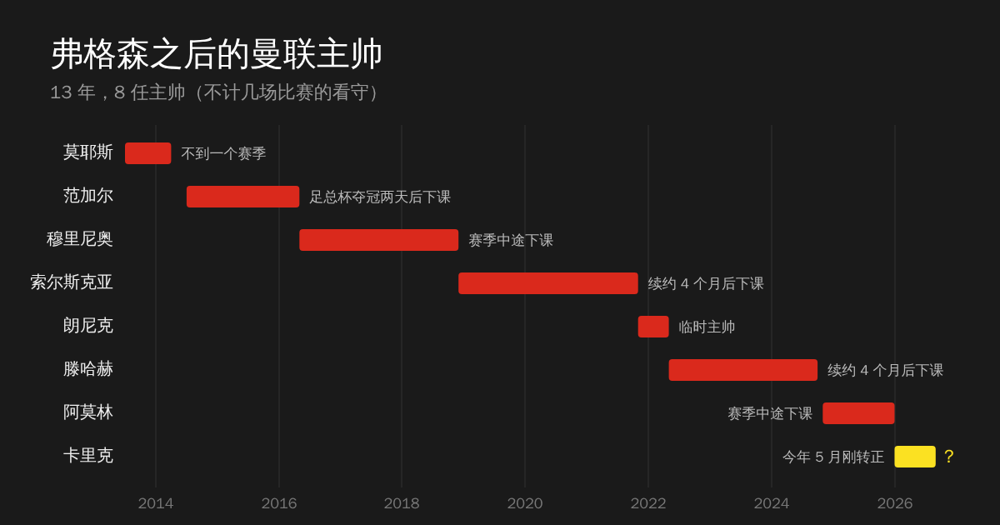

九月还没过完，但曼联这个月的比赛已经踢完了，接下来是国际比赛日。五场比赛，一胜两平两负，唯一赢下来的，是欧冠对阿塞拜疆的萨巴。

先说开心的。9 月 10 号，曼联时隔两年回到欧冠，主场 4-0 萨巴，库尼亚、B 费、塞斯科上半场就进了三个，下半场利马（利桑德罗·马丁内斯）又补了一个。对手确实弱，这场说明不了什么，但欧冠的音乐在老特拉福德响起来的时候，还是挺感动的。

然后就是剩下的四场了。

客场 2-2 埃弗顿。姆伯莫、塞斯科两次让曼联领先，结果两次都被世界波扳平：83 分钟泰里克·乔治从一个很刁钻的角度一脚轰进死角，这还是他在埃弗顿的第一个进球；补时第 6 分钟，梅特兰-奈尔斯在埃弗顿的首秀里一脚 25 码挂了死角。一场比赛让对手连开两个大保底，这场平局多少有点倒霉。

主场 0-1 曼城。福登第 23 分钟踢 B 费吃了红牌，曼联 11 打 10 打了将近 70 分钟，一个球没进，反而被哈兰德打进了。VAR 看了半天恩佐是不是越位干扰，但越位不越位先不说，本质问题是多一个人打了一个多小时也进不去。

联赛杯主场 2-3 布莱顿。10 分钟 2-0，然后上半场补时丢一个，下半场四分钟里又丢两个，被翻盘。据说这是英超时代曼联第一次在主场两球领先的情况下输球，上一次要追溯到 1976 年。

客场 1-1 富勒姆。上半场两队 26 脚射门一个球没有，下半场利马一个滑稽的乌龙，89 分钟库尼亚一脚折射才扳回来。

联赛三轮不胜，联赛杯第一轮出局，就这么进入了国际比赛日。果然，网上开始有人喊卡里克下课了。

我的态度很明确：反对换帅。

卡里克今年一月接的烂摊子，临时执教 16 场赢了 11 场，赢过曼城、阿森纳、利物浦、切尔西，把球队带回了欧冠，5 月才刚刚转正，签了两年。现在才过去四个月，踢了一个月的新赛季，就要换人？

这个剧本曼联球迷应该很眼熟了。索尔斯克亚 2021 年 7 月续约，11 月下课；滕哈赫 2024 年 7 月续约，10 月下课。俱乐部夏天给你续约，给你钱买你要的人，然后赛季开始没几个月，成绩一不好，就换人。新来的主帅接手的是一套按上一任想法搭起来的阵容，只能边踢边改，改到一半成绩不好，再换下一个。

我不是说穆里尼奥、索尔斯克亚他们不该下课，他们下课都有各自的理由。但下课的时机都很不好。要换，就在夏天换，让新主帅有一整个休赛期去搭他想要的阵容；续约了就给足耐心，至少让人家踢完一个赛季。像现在这样，夏天用续约来表示信任，秋天用下课来表示失望，最后谁都没法把一套东西完整地做完。

弗格森之后十三年，曼联换了八任主帅（不算几场比赛的看守），从莫耶斯到卡里克，风格从控球到反击到三中卫，什么都试过了。每个人都带来了一批"自己的球员"，走的时候又把这批人留给了下一任。这十三年里，唯一没怎么变的，就是这套换帅的逻辑本身。

所以曼联的问题是结构性的问题：引援没有一个长期一致的方向，买人很大程度上跟着当下的主帅走；阵容永远是好几任主帅留下来的拼盘；管理层对主帅的信任，永远只取决于最近几场的比分。这些问题不解决，光换一个主教练有什么用？换来的，只能是下一个咪一鸠样而已。

卡里克不一定是对的人，这个我也不知道。但至少，让他踢完这个赛季吧。
