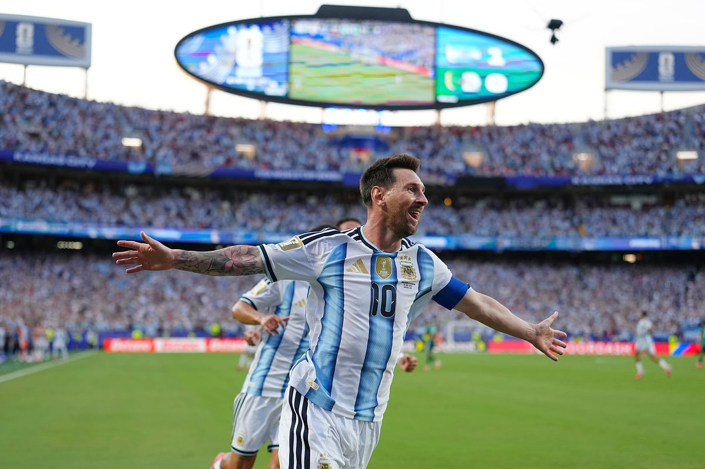

今天阿根廷在堪萨斯城3-0击败阿尔及利亚，揭幕战拿下卫冕之旅的第一场。但比起3-0这个比分，今天真正让人看完睡不着的是39岁的梅西，三粒进球，职业生涯第一次世界杯戴帽，而且这场刚好是他第200场国家队比赛。

我不是阿根廷球迷，平时也很少看南美球队，主要还是看英超。我也不算梅西粉丝，但还是要先表明一下成分。讨论梅西历史地位时，怎么都要在前三。讨论C罗历史地位，怎么都离不开前七。要不然我觉得多少带点滤镜了。

先聊几个我看到觉得有点离谱的数字。一个是16个世界杯进球，今晚刚好追平克洛泽，是男足世界杯历史进球的并列第一了。一个是连续5届世界杯都有进球，加上今天这三个，他是继C罗之后第二位达成的球员。还有一个稍微抽象一点：他今天成为阿根廷队史最老的世界杯进球者，而距离他成为阿根廷队史最年轻的世界杯进球者，刚好整整20年。20年还能在世界杯上一直进球的，足球史上能数出来的人估计真不多（我没查，但应该没几个）。

说实话，22年世界杯前我以为梅西的世界杯故事就到那里了。当时阿根廷揭幕战还输给了沙特，那场看完我真觉得这哥们要带着遗憾退役了，结果他一路把队伍带到决赛，还跟姆巴佩对飙帽子，最后把大力神杯举起来了。那之后这几年他在迈阿密国际踢得虽然说是鹤立鸡群，但毕竟是美职联，年龄又一年一年涨，所有人都觉得他不会再来一届世界杯，包括他自己，他采访里也说过几次22年就是最后一届。

但他还是来了，而且也不像是来告别的。大部分球员35岁之后掉得很快，速度、爆发力、对抗一项一项往下走，技术再细腻也撑不住。但梅西好像不太吃这一套，他年轻时候本来就不靠速度吃饭，更多是节奏和小范围处理球，这种东西比较扛年龄。加上他从来也不是肌肉怪，伤病记录在巨星里算很少的。我觉得支撑梅西的，除了天赋，努力，还有伟大的性格。

身为曼联球迷，这些年我自然看C罗看得更多，年轻时候也实打实偏爱过他一段时间。但说实话，我心里一直清楚两个人是有差距的。08年欧冠半决赛曼联过掉巴萨那次，梅西还很年轻，但你已经能看出此子必成大器了，那种小范围处理球的节奏和决策速度，跟同龄人完全不是一回事。后来09年、11年，两次欧冠决赛巴萨都把曼联干翻了，那两场梅西踢得，基本是把自己的天赋摆在桌上一遍一遍按头给你看。我作为曼联球迷当然是失望的，但也得承认，差距就摆在那。

当然C罗也不是没东西。他靠苦行僧式的自律和身体管理把自己保持到了40岁，这种自我管理放在足球史也找不出几个。我知道他这些年场内场外有不少挺抽象的行为，但巅峰期的C罗也是实打实跟同代球员拉开过一档的人，这一点不能因为后来的事情就一笔抹掉。只是放梅西旁边比一比，确实会显得稍微"人间"一点。

不管怎么说，今天看到梅西踢成这样，还是会感慨。这两个人是真的撑住了整整一个时代，撑到现在还没散。我们这代球迷算是真的运气好了，从他们开始到现在一路看下来，而且看起来这个"现在"还能再拉长一点。

至于克洛泽的纪录，应该也就这几场的事了。阿根廷小组赛还有两场，淘汰赛只要进得去，他大概率会超过去。说不定再多踢几个，把这个纪录顶到一个未来十几年都难破的位置。

39岁了还能踢成这样。希望今年夏天他还能再多带几场让我熬夜的比赛。

