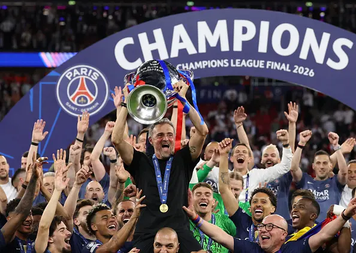

大巴黎点球大战战胜了阿森纳夺得了2026的欧冠冠军。我平时基本只看英超，所以对于大巴黎没啥能聊的了，只知道恩里克也埋入了3座欧冠奖杯的俱乐部。很多人都认为在法甲这样一家独大的联赛，跟一群“菜篓子”踢球，会让自己也变菜的。但从输给拜仁到现在卫冕成功，巴黎也是一步一步一个脚印的走到了现在。尽管许多英超球迷看不上法甲，但巴黎这两年夺冠基本是把英超队伍赢了个遍，含金量很满。

相对炙手可热的K77，金球先生登贝莱，世一边门德斯，阿森纳这边的顶级球星可能没那么多——至少看不出谁有夺金球的希望。但阿森纳今天表现的很勇敢，每个半场抢开局，然后回来打反击。只能说尽力了，大巴黎的边路优势明显，阿森纳这边廷伯刚刚伤愈没法首发（话说这也是我FM爱将了）。到了后期两边基本完全顶不住了，而且大巴黎还有后手。而萨卡、厄德高的发挥就明显不及了，他俩和世界级球员的差距，可能就在大赛发挥这一点吧。

我不是阿森纳球迷，相反，由于竞争关系的缘故，我其实并不喜欢阿森纳。但我觉得毫无疑问，接下来的几年，阿森纳都会是英超冠军的最有力竞争者，在欧冠上也还有突破的希望。

阿尔特塔在阿森纳当主帅也快7年了，一度成绩也非常糟糕，我还记得20年那会，索尔斯克亚、兰帕德、阿尔特塔三个DNA主帅都在英超，成绩都不咋样，一度阿尔特塔是下课赔率最高的。但后来兰帕德和索尔斯克亚先后下课，而阿尔特塔一直坚持到了现在。成绩是一步步上升，从三连亚到今年夺冠，也算是厚积薄发了。

这只阿森纳的核心成员都还年轻，萨利巴、赖斯、厄德高、哈弗茨、萨卡，主要成员都还有至少3-5年的巅峰可以期待，唯一年龄少打的核心是门将拉亚，但门将位置比较特殊，35岁还处巅峰的也很常见，问题不大。可以说这支阿森纳非常的未来可期了。目前，切尔西、利物浦、曼城都属于刚刚换帅，曼联单薄的阵容即将面临多线作战的考研，可以说主要竞争对手都处于低谷期，接下来的几年窗口期相信阿森纳仍然大有可为。

但想突破欧冠，可能就需要一些运气了。阿森纳现在的前场球员总给人一种厉害但又不顶级的感觉，可能还是得突破一下心魔才好带领球队整体突破。

最后，姆总监，你怎么说，大巴黎能实现欧冠金球梦想不。

