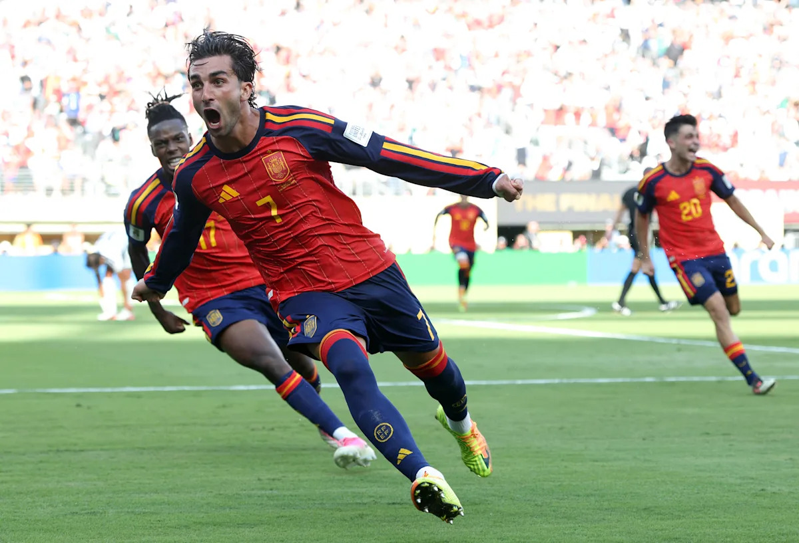

北京时间今天凌晨，美加墨世界杯决赛，西班牙加时赛1-0击败阿根廷，拿到队史第二座大力神杯。虽然打到了加时下半场才进球，但本质上这是一场一边倒的比赛：西班牙全场20脚射门，大马丁做出了11次扑救，直接创下世界杯决赛的扑救纪录。这个数字比比分诚实多了。

比赛的走向其实早早就定了。西班牙从头到尾控着球，阿根廷整场被摁在半场里，出球点一个一个被掐死。恩佐82分钟因为连续犯规先吃一张黄牌，90+2分钟又放倒了库巴西，两黄变一红，加时赛还没开始，阿根廷就只剩10个人了。自从恩佐吃了红牌，阿根廷本质上就只有拖到点球大战一个赢法，而能把比赛拖进加时，已经是大马丁一次一次奋力扑救的结果了。阿根廷的第一脚射门，一直到加时赛下半场才出现。而加时下半场刚开始39秒，替补登场的费兰·托雷斯近距离完成绝杀。在这之前阿根廷的防线已经十分混乱了，说实话VAR看了好几遍我也没看出被取消的进球哪里犯规了。

梅西本人看起来跟四年前一样强，这不是安慰的话。但他身边的人不一样了：迪玛利亚在24年美洲杯之后就退出了国家队，麦卡和小蜘蛛这个赛季在俱乐部都表现平平，恩佐又提前下去了。对抗其他球队的时候，梅西可以散步把体能留到爆发的那几分钟，这套打法一路用到了决赛。但西班牙太强了，散步的结果就是中场完全失控，球都拿不到，爆发也就无从谈起。

所以梅西终究没能成为无可争议的GOAT，差的可能就是今天这一座。以后人们记住的，大约是"三大球王之一"吧。略有遗憾，但说实话，他本届的表现已经足够好了：8球4助攻，一个39岁的人。

再说西班牙。21世纪之后这个国家的足球人才就是一代一代往外涌，08到12年那批人拿了欧洲杯-世界杯-欧洲杯三连，现在这批人欧洲杯2024、世界杯2026又连着来了。更可怕的是年龄结构：亚马尔决赛前六天刚过完19岁生日，同样19岁的库巴西首发打满了整届比赛。28年欧洲杯，是不是也可以期待一下。

而撑起这一切的还是罗德里。队长，本届世界杯金球奖得主，决赛105次传球成功101次。十字韧带重伤报销了大半个赛季，回来之后还是那个罗德里。日常看英超，我对他的重要性和作用有着非常清楚的认知。隔壁葡萄牙这些年中场攒了一手好牌，个个都被叫过"世一中"，好好学学金球先生罗德里是怎么踢球的吧。

