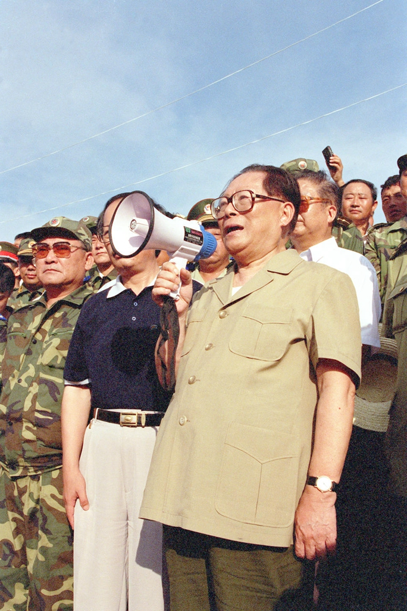

今天是江泽民诞辰100周年，1926年8月17日，江苏扬州。我1990年出生，他1989年6月接任总书记，1993年当上国家主席——也就是说，我开始记事之前他就已经是这个国家的最高领导人了。小时候完全不觉得这有什么，我们那个年代长大的人刚开始接触外界各种各样的信息，年龄小也没啥判断力，甚至觉得"改革开放"没什么了不起的，说开放就开放了，经济发展也只是开放顺理成章的结果罢了。实际上稍微长大就了解到，完全不是这么一回事。

把他接手时的局面、这些年他遇到的外部挑战摆出来看，就知道这活有多难干。1989年政治风波之后西方对华全面制裁，那两年GDP增速直接掉到5%以下。1991年初的海湾战争，高技术局部战争第一次摆到全世界面前，战争形态从机械化往信息化转，所有国家的军队都得重新学一遍怎么打仗。同年底苏联解体，同一个体制的老大哥直接散了，当时全世界都在等着看下一个是谁。1995年到1996年是台海危机，解放军先后两轮导弹试射和军演，美国把"独立"号和"尼米兹"号两个航母战斗群摆到台湾附近，那是越战之后美军最大规模的一次武力展示。往后是1997年亚洲金融危机、1998年那场洪水、1999年5月8日使馆被炸。这里面随便哪一件处理砸了，后面的故事就是完全另一个版本。

然而他不仅处理得很好，还取得了经济上的巨大发展。1989到2001年，国内生产总值从16909亿元涨到95933亿元，年均增长9.3%，比同期世界经济增速快6.1个百分点。进出口总额从1989年的1117亿美元涨到2001年的5098亿美元，出口的世界排名从第11位升到第6位。外汇储备从56亿美元涨到2122亿美元，排到世界第二，仅次于日本。2001年外商直接投资469亿美元，是1989年的14倍。而我觉得最有分量的一个是：农村贫困人口到2001年只剩2900多万，比1989年减少了7000多万。7000万人，这个数字放在世界上绝大多数国家都比全国人口还多。

危机处理这块，1997年那次尤其能看出水平。泰铢崩了之后危机一路传染，港币的联系汇率被国际炒家连着攻了好几轮。中国政府承诺人民币不贬值，并且守住了。这在当时不是个轻松的选择——贬值对出口是实打实的短期利好，不贬值等于自己扛住压力，替整个地区稳信心。1998年8月香港那场金融保卫战最后能赢，这个承诺是背景之一。1998年的洪水也是同一个逻辑：长江那次是1954年之后第二次全流域性大洪水，松花江、嫩江是150年来最严重的，解放军和武警前后调动66个师旅，到8月23日投入兵力433万人次，还组织了民兵预备役500多万。后来看到2005年卡特里娜飓风里那个世界霸主是怎么应对自然灾害的——新奥尔良的堤防在50多处溃决，八成城区被淹，死了1800多人，事后调查认定问题不只在天灾，堤防本身的设计施工就不合格——只能说高下立判。

1997年7月1日和1999年12月20日，他两次站在交接仪式上，宣布中国政府恢复对香港、对澳门行使主权。这两件事的框架是邓小平定的，谈判也是前面几任接力谈下来的，功劳不能都算他的。但把两套完全不同的治理体系真正接过来、让它运转下去，是在他手上完成的。而且无论如何，后面的历史写到这段时间，这两件大事总是逃不掉的。

不过我觉得更能说明这个人水平的，是他留给继任者的东西。2001年12月11日，中国正式成为世贸组织第143个成员，这事前后谈了15年，从1986年递交申请开始，谈判组的人是"黑发人谈成了白发人"。后面二十年中国制造业的爆发，起点就在这儿。同样是2001年，7月13日莫斯科，国际奥委会第112次全会第二轮投票，北京56票，多伦多22票，巴黎18票，伊斯坦布尔9票。奥运会是2008年办的，但票是2001年拿的。

再往前的几个更明显。1992年9月21日，中央决定上载人航天工程，代号就直接叫"921"，同时定下了"三步走"战略；杨利伟上天是2003年，立项在十一年前。1994年12月14日三峡工程在宜昌三斗坪正式开工，之前论证了整整40年。2001年6月29日，青藏铁路格尔木到拉萨段开工，全线通车要等到2006年。1994年4月20日，一条64K国际专线开通，中国实现全功能接入国际互联网，是第77个接入的国家——作为一个靠这行吃饭的人，这条我得单独谢一下。1999年6月17日他在西安提出加快西部开发，同年11月的中央经济工作会议正式启动西部大开发。1998年3月23日，歼-10在成都首飞，这是中国第一款自主研制的第三代战斗机，1986年立项，中间因为发动机问题几次差点下马，前后磨了十几年。网上流传他视察成飞时说过"这架飞机是给我们中国人壮胆的飞机"，这句话我只在二手报道里见过，没找到官方出处，所以只能算传闻。但首飞确实是在他任内完成的，那句话的意思我觉得也不算错。这些事有个很明显的共同点：决定都是他任内做的，好处大多要等到他卸任之后才显出来。

还有一点我个人觉得挺有意思的：他是个工科出身的人。1943年考进南京中央大学电机系，抗战胜利后转到上海交通大学电机系。1954年调去参加建设长春第一汽车制造厂，1955年4月到莫斯科斯大林汽车厂实习，第二年回国，在一汽当过动力处副处长、动力分厂厂长。1964年和1965年，他作为中国代表团副团长去日本和法国参加国际电工委员会年会。一个在车间里管过动力设备、三十多岁能代表国家去开IEC年会的人，后来去主持一个国家的经济转型，我总觉得这份履历和他任内那种"先把框架定下来再往里填东西"的做法是有关系的。1992年6月9日他在中央党校讲话，说"我个人的看法，比较倾向于使用'社会主义市场经济体制'这个提法"，四个月后的十四大就把这句话写成了整个国家的改革目标。

不过定了框架不等于事情就能办成。我以前一直有个很天真的印象，觉得最高领导人拍个板，政策就自动往下走了。可惜事情要是那么简单就好了。1994年，分税制改革，前一年，中央财政收入占全国财政收入的比重只有22%，穷到向地方借过两次钱——中央政府跟自己的省份借钱，这状态显然维持不下去。但分税制的实质，是把地方已经握在手里的钱重新划一块给中央，这种事没有哪个省会主动欢迎。所以1993年9月9日起，朱镕基受江泽民和李鹏之托，带着体改委、财政部、税务总局60多人的队伍，一个省一个省地去谈，前后走了17个省市自治区，历时70多天；江泽民自己也多次分片召集各省省委书记、省长开座谈会，用项怀诚的说法是"亲自做工作"。关键一站是广东，因为广东在原来的包干制下受益最大。而最后方案里一个很要紧的让步——以哪一年作基数——还是广东省委书记谢非提出来的：他跟朱镕基说1993年广东的收入正在涨，要是按1992年作基数，广东1993年涨出来的那块就得交上去。中央接受了以1993年作基数。1993年12月15日国务院发文，1994年1月1日实施，当年中央财政收入涨了203.5%，占全国的比重一举过半。一个把中央财政从两成拉到一半以上的改革，是这么一站一站谈下来的，不是发个文件就完事。

军队那边也是同一个道理。1991年初的海湾战争让军委上下都受了刺激，江泽民为这一场战争三次参加座谈会，提的问题很直接：将来的战争究竟怎么打。结论是要下大气力发展国防科技，武器装备上得有"杀手锏"。1993年1月的中央军委扩大会议定下新时期军事战略方针，把军事斗争准备的基点放在"打赢现代技术特别是高技术条件下的局部战争"上；1995年12月又提出科技强军和"两个根本性转变"——由数量规模型向质量效能型、由人力密集型向科技密集型。1997年9月12日他在十五大报告里宣布，在八十年代裁减100万的基础上三年内再裁军50万，这个任务到1999年底完成；2003年9月又宣布2005年前再裁20万，把总规模压到230万。

但要说真正得罪人的，是军队停止经商。那时候军队和武警办了大量经营性公司，钱和权缠在一起。1998年7月13日的全国打击走私工作会议上，江泽民点了军队一家公司用加工贸易方式走私进口铁矿砂的案子，明确提出军队、武警和政法机关必须停止一切经商活动。九天后的7月22日，在解放军四总部联合召开的全军反走私大会上，他正式向全军宣布中央的决定：军队和武警部队对所属单位办的各种经营性公司要认真清理，"今后一律不再从事经商活动"，地方政法部门同样一律不再经商。到1998年12月15日，军队和武警所办的经营性企业全数完成脱钩。分税制是从各省手里划钱，这一次是从枪杆子手里划钱，而他1989年才接手军委，本人也没有任何战功背景。这件事能办成，我觉得比GDP那几个数字更能说明他手上到底有多少实际能力。

2002年11月15日，十六届一中全会，76岁的他不再担任总书记，2004年9月又辞去了军委主席。他2022年11月30日在上海去世，96岁。

文末那张照片是1998年8月13日在洪湖市乌林镇中沙角险段拍的，他站在长江大堤上举着扩音器喊话。查资料的时候我才注意到一个巧合：那天距离他72岁生日只差4天。二十八年前的这几天，71岁的他在一条随时可能溃的堤上；而今天，是他100岁。"我们中华民族是有着很强的凝聚力，任何的困难都压不倒我们，中国人民是不可战胜的！"很遗憾我没找到这句话出处源头的照片，只知道这是抗洪期间的，但第一次听到这段话的时候，大概就是我爱国热情觉醒的时候吧。

